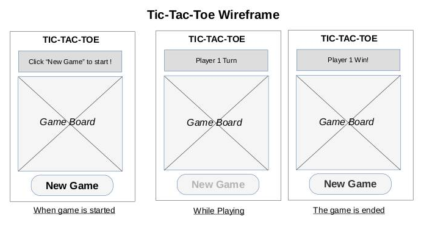

# TicTacToe

## GameRules
1. The game is played on a grid that's 3 squares by 3 squares.

2. You are X, your friend (or the computer in this case) is O. Players take turns putting their marks in empty squares.

3. The first player to get 3 of her marks in a row (up, down, across, or diagonally) is the winner.

4. When all 9 squares are full, the game is over. If no player has 3 marks in a row, the game ends in a tie.

## Schedule (Objectives/Goals)
### Wednesday
1. Wireframes
2. Pseudo Code

### Thursday

1. JS
Player Objects
### Friday

1. JS
2. boardGame fuction
### Saturday
1.HTML/CSS
### Sunday

## References: 
https://kencoding.wordpress.com/2015/02/11/tictactoe-game-design/